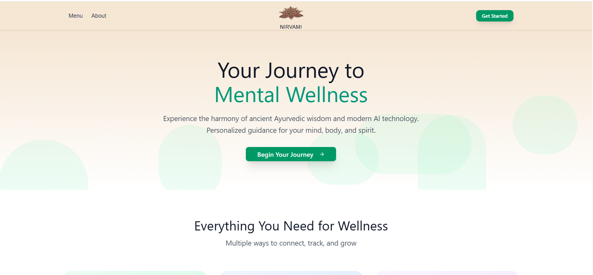
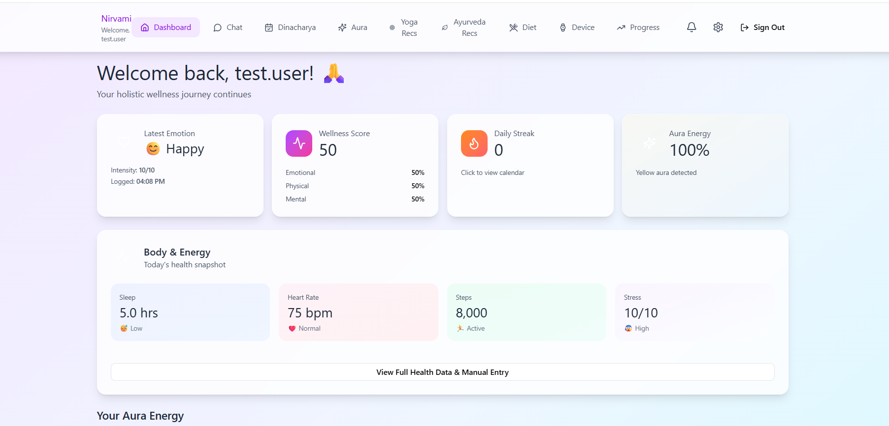

# Nirvami - AI-Powered Mental Wellness Platform

[](https://www.python.org/downloads/)
[](https://reactjs.org/)
[](https://www.typescriptlang.org/)
[](https://fastapi.tiangolo.com/)
[](LICENSE)

**Nirvami** is an intelligent mental health companion that bridges ancient Ayurvedic wisdom with modern AI technology to provide personalized mental wellness support. The platform combines emotion detection, dosha-based recommendations, wellness tracking, holistic health analytics, AI chatbot with automatic recommendation extraction, and SMS notifications for health alerts.

**Last Updated**: December 8, 2024

---

## 📸 Platform Preview

### Home Page

*Welcome to Nirvami - Your journey to mental wellness begins here*

### Dashboard

*Comprehensive wellness dashboard with real-time metrics and insights*

---

## ✨ Why Nirvami?

<table>
<tr>
<td width="50%">

**🎯 Personalized Wellness**
- Dosha-based Ayurvedic recommendations
- AI-driven emotion analysis
- Custom wellness scoring
- Adaptive guidance

**🤖 AI-Powered Intelligence**
- Google Gemini chatbot
- Automatic recommendation extraction
- Emotion detection from text
- Predictive health insights

</td>
<td width="50%">

**📱 Comprehensive Tracking**
- Wearable device integration
- Meal-mood correlation
- Daily routine monitoring
- Real-time health alerts

**🔔 Smart Notifications**
- SMS alerts via Twilio
- In-app health warnings
- Anomaly detection
- Proactive wellness reminders

</td>
</tr>
</table>

---

## 🌟 Key Features

> **Nirvami combines cutting-edge AI with time-tested Ayurvedic principles to deliver a comprehensive mental wellness experience.**

### 🧠 AI-Powered Emotion Intelligence
- **Multi-Modal Emotion Detection**: Analyze emotions from text, voice, and user interactions
- **Real-Time Sentiment Analysis**: Advanced ML models (Flan-T5, MiniLM) for accurate emotion classification
- **Emotion Timeline**: Track emotional patterns over time with detailed analytics
- **15 Mental States Supported**: Balanced, Energized, Stressed, Focused, Tired, Joyful, Sad, Angry, Peaceful, Confused, Motivated, Overwhelmed, Creative, Restless, Grateful

### 🎨 Aura Visualization System
- **Dynamic Aura Colors**: 9 distinct aura colors mapped to emotional and mental states
- **Real-Time Updates**: Aura changes based on latest mood logs
- **Chakra & Element Mapping**: Each aura associated with specific chakras and natural elements
- **Visual Representation**: 3D spinning sphere with gradient effects showing current emotional energy
- **24-Hour Reset**: Aura returns to neutral grey if no mood logged in 24 hours

### 🧘 Ayurvedic Dosha Integration
- **Personalized Dosha Assessment**: Interactive quiz to determine Vata, Pitta, or Kapha constitution
- **Dosha-Based Recommendations**: Customized suggestions for diet, yoga, and daily routines
- **Balance Tracking**: Monitor dosha balance over time
- **Ayurvedic Resources**: Curated content on herbs, practices, and lifestyle adjustments

### 💪 Wellness Scoring & Analytics
- **Comprehensive Wellness Score**: Multi-dimensional scoring (0-100) based on:
  - Emotional state (40% weight)
  - Physical health metrics (30% weight)
  - Lifestyle factors (30% weight)
- **Historical Trends**: Track wellness improvements over days, weeks, and months
- **Predictive Insights**: AI-powered alerts for potential health risks

### 📊 Wearable Data Integration
- **Manual Health Entry**: Log sleep, heart rate, steps, stress, and calories
- **Apple Watch XML Upload**: Bulk import historical health data from Apple Health exports
- **Real-Time Health Analysis**: Automated detection of 6+ health anomalies:
  - High/Low heart rate
  - Severe stress levels
  - Sleep deprivation
  - Sedentary behavior
  - Combined risk factors (sleep + stress, activity + stress, triple threat)
- **Smart Notifications**: In-app alerts with SMS support for critical health events
- **SMS Notifications**: Automatic SMS alerts sent via Twilio when wearable data analysis is complete

### 🍽️ Meal & Diet Tracking
- **Meal Logging**: Record meals with timestamps and descriptions
- **Meal-Emotion Correlation**: AI analyzes relationships between diet and mood
- **Ayurvedic Diet Recommendations**: Dosha-specific food suggestions
- **Nutrition Insights**: Track dietary patterns and their emotional impact

### 🧘‍♀️ Yoga & Sound Therapy
- **Yoga Pose Library**: 50+ poses with detailed instructions and images
- **Dosha-Specific Sequences**: Personalized yoga routines based on constitution
- **Sound Healing**: Curated sound therapy sessions for different emotional states
- **Progress Tracking**: Monitor yoga practice consistency and benefits

### 📅 Daily Routines (Dinacharya)
- **Ayurvedic Routine Tracking**: Log daily activities aligned with Ayurvedic principles
- **Multiple Entries Per Day**: Track morning rituals, midday practices, and evening routines
- **Routine Analytics**: Identify patterns and optimize daily schedule
- **Custom Activities**: Flexible logging for personalized wellness activities

### 💬 AI Chatbot Companion
- **Conversational AI**: Powered by Google Gemini (gemini-flash-latest) for natural, empathetic interactions
- **Context-Aware Responses**: Chatbot understands user's emotional state and history
- **Real-Time Emotion Detection**: Analyzes conversation sentiment to update mood logs
- **Personalized Guidance**: Provides recommendations based on user's dosha, wellness score, and current state
- **Smart Recommendation Extraction**: Automatically extracts and saves actionable wellness recommendations (yoga poses, breathing techniques, meditation practices) to recommendations page
- **Mental Health Focus**: Specialized in yoga, Ayurveda, meditation, breathing exercises, and holistic wellness

### 📈 Dashboard & Analytics
- **Unified Health Dashboard**: Real-time overview of all wellness metrics
- **Streak Tracking**: Monitor daily login consistency and engagement
- **Recent Activity Feed**: Latest emotions, meals, and health entries
- **Visual Data Representation**: Charts, graphs, and color-coded indicators
- **Quick Actions**: Log mood, add meal, or enter health data from dashboard

---

## 🏗️ Technology Stack

### Frontend
| Technology | Purpose |
|-----------|----------|
| **React 18 + TypeScript** | Component-based UI with type safety |
| **TailwindCSS** | Utility-first styling framework |
| **Framer Motion** | Smooth animations and transitions |
| **React Hooks + Context API** | State management |
| **Axios** | HTTP client for API calls |
| **Vite** | Fast build tool and dev server |

### Backend
| Technology | Purpose |
|-----------|----------|
| **FastAPI** | High-performance Python web framework |
| **Supabase (PostgreSQL)** | Database and authentication |
| **JWT** | Secure token-based authentication |
| **Google Flan-T5-Base** | Text emotion analysis |
| **Sentence Transformers MiniLM-L6-v2** | Semantic embeddings for RAG |
| **Google Gemini (gemini-flash-latest)** | Conversational AI chatbot |
| **Twilio SMS API** | SMS notifications |
| **Redis** | Background job queue |
- **Background Jobs**: RQ (Redis Queue)
- **API Documentation**: Swagger/OpenAPI

### Database Schema
- `profiles` - User accounts and preferences
- `emotion_logs` - Emotion detection results with confidence scores
- `aura_entries` - Daily aura visualizations with color/intensity
- `wellness_scores` - Comprehensive wellness calculations
- `dosha_assessments` - Ayurvedic constitution evaluations
- `meal_logs` - Diet tracking with timestamps
- `wearable_snapshots` - Health metrics from devices/manual entry
- `daily_routines` - Ayurvedic routine tracking
- `yoga_content` - Pose library with instructions
- `messages` - Chat history with AI companion
- `health_alerts` - Automated health notifications
- `recommendations` - AI-extracted wellness recommendations from chatbot

---

## 🚀 Getting Started

### Prerequisites

Ensure you have the following installed and configured:

| Requirement | Version | Purpose |
|------------|---------|----------|
| **Node.js** | 18+ | Frontend development |
| **Python** | 3.10+ | Backend API |
| **Supabase Account** | - | PostgreSQL database |
| **Redis** | Latest | Background job processing |
| **Google Gemini API** | gemini-flash-latest | AI chatbot |
| **Twilio Account** | - | SMS notifications (optional) |

### Quick Start

```bash
# Clone the repository
git clone https://github.com/Supriya-gouda/Nirvami.git
cd Nirvami

# Start frontend (Terminal 1)
cd frontend
npm install
npm run dev

# Start backend (Terminal 2)
cd backend
python -m venv venv
.\venv\Scripts\activate
pip install -r requirements.txt
python run_dev.py
```

### Detailed Installation

#### 1. Clone Repository
```bash
git clone https://github.com/Supriya-gouda/Nirvami.git
cd Nirvami
```

#### 2. Frontend Setup
```bash
cd frontend

# Install dependencies
npm install

# Start development server
npm run dev
```
Frontend runs on `http://localhost:5173`

See [frontend/README.md](frontend/README.md) for detailed frontend documentation.

#### 3. Backend Setup
```bash
cd backend

# Create virtual environment
python -m venv venv
.\venv\Scripts\activate  # Windows
source venv/bin/activate  # Mac/Linux

# Install dependencies
pip install -r requirements.txt

# Configure environment variables
# Copy .env.example to .env and fill in:
# - SUPABASE_URL
# - SUPABASE_SERVICE_KEY
# - GEMINI_API_KEY (for gemini-flash-latest model)
# - JWT_SECRET_KEY
# - TWILIO_ACCOUNT_SID (optional - for SMS)
# - TWILIO_AUTH_TOKEN (optional - for SMS)
# - TWILIO_MESSAGING_SERVICE_SID (optional - for SMS)

# Apply database schema
python scripts/apply_schema.py

# Start backend server
python run_dev.py
# OR
.\start-dev.ps1  # Windows PowerShell
```
Backend runs on `http://localhost:8000`

See [backend/README.md](backend/README.md) for detailed backend documentation.

#### 4. Database Setup
```bash
cd backend

# Seed initial data (optional)
python scripts/seed_dosha_recommendations.py
python scripts/seed_yoga_content.py
python scripts/seed_ayurveda_resources.py
```

---

## 📁 Project Structure

```
Nirvami/
├── frontend/                     # React + TypeScript frontend
│   ├── src/
│   │   ├── components/           # React components
│   │   │   ├── ui/              # Reusable UI components (shadcn/ui)
│   │   │   ├── Dashboard.tsx    # Main dashboard
│   │   │   ├── ChatbotPage.tsx  # AI chatbot interface
│   │   │   ├── AuraVisualizationPage.tsx  # Aura 3D display
│   │   │   ├── EmotionHistoryPage.tsx     # Emotion timeline
│   │   │   ├── DoshaQuizPage.tsx          # Ayurvedic assessment
│   │   │   ├── DailyRoutinesPage.tsx      # Routine tracking
│   │   │   ├── DevicePage.tsx             # Wearable data entry
│   │   │   ├── DietMoodPage.tsx           # Meal logging
│   │   │   ├── YogaLifestylePage.tsx      # Yoga & sound therapy
│   │   │   └── ...                        # Other pages
│   │   ├── services/
│   │   │   └── api.ts            # API client (40+ endpoints)
│   │   ├── contexts/
│   │   │   └── AuthContext.tsx   # Authentication state
│   │   ├── types/
│   │   │   └── api.types.ts      # TypeScript definitions
│   │   ├── styles/               # Global CSS
│   │   ├── App.tsx               # Main app component
│   │   └── main.tsx              # Entry point
│   ├── index.html                # HTML template
│   ├── package.json              # Frontend dependencies
│   ├── tsconfig.json             # TypeScript config
│   ├── vite.config.ts            # Vite build config
│   └── README.md                 # Frontend documentation
│
├── backend/                      # FastAPI Python backend
│   ├── app/
│   │   ├── api/
│   │   │   └── routes/           # API route handlers
│   │   │       ├── aura.py       # Aura generation & history
│   │   │       ├── chat.py       # Chatbot with emotion detection
│   │   │       ├── emotions.py   # Emotion logging & analytics
│   │   │       ├── wellness.py   # Wellness score calculation
│   │   │       ├── dosha.py      # Dosha assessment & recommendations
│   │   │       ├── meals.py      # Meal logging & correlations
│   │   │       ├── wearable.py   # Health data & alerts
│   │   │       ├── yoga.py       # Yoga content & routines
│   │   │       └── routines.py   # Daily routine tracking
│   │   ├── services/             # Business logic layer
│   │   │   ├── aura_service.py   # Aura computation from emotions
│   │   │   ├── emotion_service.py # ML-based emotion detection
│   │   │   ├── wearable_service.py # Health analytics & anomalies
│   │   │   └── ...
│   │   ├── models/
│   │   │   └── schemas.py        # Pydantic data models
│   │   ├── utils/
│   │   │   ├── auth.py           # JWT authentication
│   │   │   └── database.py       # Supabase client
│   │   └── workers/
│   │       └── jobs.py           # Background tasks
│   ├── database/
│   │   └── schema.sql            # Complete database schema (30+ tables)
│   ├── scripts/                  # Setup & seeding scripts
│   │   ├── apply_schema.py       # Apply database schema
│   │   ├── seed_*.py             # Seed initial data
│   │   └── ...
│   ├── requirements.txt          # Python dependencies
│   ├── run_dev.py                # Development server
│   └── README.md                 # Backend documentation
│
├── .git/                         # Git repository
├── .gitignore                    # Git ignore rules
├── README.md                     # This file - project overview
└── .vscode/                      # VS Code settings
```

---

## 🔧 API Endpoints

### Authentication
- `POST /api/v1/auth/signup` - Create new account
- `POST /api/v1/auth/login` - Login with credentials
- `POST /api/v1/auth/guest` - Continue as guest

### Profile
- `GET /api/v1/profile/me` - Get user profile
- `PUT /api/v1/profile/me` - Update profile
- `GET /api/v1/profile/streak/current` - Get login streak

### Emotions
- `POST /api/v1/emotions/log` - Log emotion manually
- `GET /api/v1/emotions/logs` - Get emotion history
- `GET /api/v1/emotions/timeline` - Get emotion timeline with analytics

### Aura
- `GET /api/v1/aura/today` - Get today's aura
- `GET /api/v1/aura/from-latest-emotion` - Get dynamic aura from latest mood log
- `POST /api/v1/aura/generate` - Regenerate today's aura
- `GET /api/v1/aura/timeline` - Get aura history (30 days)

### Wellness
- `GET /api/v1/wellness/today` - Get today's wellness score
- `GET /api/v1/wellness/history` - Get wellness score history

### Dosha
- `POST /api/v1/dosha/assess` - Submit dosha quiz answers
- `GET /api/v1/dosha/latest` - Get latest dosha assessment
- `GET /api/v1/dosha/recommendations` - Get personalized recommendations

### Meals
- `POST /api/v1/meals` - Log a meal
- `GET /api/v1/meals` - Get meal history
- `GET /api/v1/meals/correlations` - Get meal-emotion correlations

### Wearable
- `POST /api/v1/wearable/manual-entry` - Log health metrics manually
- `POST /api/v1/wearable/upload-xml` - Upload Apple Health XML export
- `GET /api/v1/wearable/latest` - Get latest health snapshot
- `GET /api/v1/wearable/analyze` - Analyze health data and detect anomalies
- `GET /api/v1/wearable/history` - Get health history (30 days)

### Yoga
- `GET /api/v1/yoga/poses` - Get yoga pose library
- `GET /api/v1/yoga/recommendations` - Get dosha-specific poses
- `GET /api/v1/yoga/ayurveda-resources` - Get Ayurvedic resources

### Daily Routines
- `POST /api/v1/routines/entry` - Add routine entry
- `GET /api/v1/routines/entries` - Get routine history
- `DELETE /api/v1/routines/entry/{id}` - Delete routine

### Chat
- `POST /api/v1/chat/message` - Send message to AI chatbot
- `GET /api/v1/chat/history` - Get chat history
- `GET /api/v1/recommendations` - Get AI-extracted recommendations by category
- `GET /api/v1/chat/history` - Get chat conversation history

### Alerts
- `GET /api/v1/alerts/active` - Get active health alerts
- `POST /api/v1/alerts/dismiss` - Dismiss an alert

---

## 🎯 Implementation Status

### ✅ Fully Implemented Features

#### Core System
- ✅ User authentication (signup, login, guest mode)
- ✅ JWT token-based security
- ✅ Row-Level Security (RLS) on all database tables
- ✅ Responsive UI with mobile support
- ✅ Navigation system with bottom navigation bar

#### Emotion & Mental Health
- ✅ Multi-modal emotion detection (text, voice context)
- ✅ 15 mental states classification
- ✅ Emotion logging with confidence scores
- ✅ Emotion timeline and analytics
- ✅ Historical emotion tracking

#### Aura Visualization
- ✅ Dynamic aura generation from latest emotion
- ✅ 9 aura colors with gradient effects
- ✅ 3D spinning sphere visualization
- ✅ Real-time aura updates on mood logs
- ✅ 24-hour aura reset mechanism
- ✅ Chakra and element associations
- ✅ Aura history timeline

#### Wellness Scoring
- ✅ Comprehensive wellness calculation algorithm
- ✅ Multi-factor scoring (emotion, physical, lifestyle)
- ✅ Daily wellness score generation
- ✅ Historical wellness tracking
- ✅ Wellness trends and analytics

#### Dosha System
- ✅ Interactive dosha assessment quiz
- ✅ Vata, Pitta, Kapha constitution determination
- ✅ Dosha-specific recommendations (diet, yoga, lifestyle)
- ✅ Dosha balance tracking
- ✅ Ayurvedic resources library

#### Wearable Integration
- ✅ Manual health data entry (sleep, HR, steps, stress, calories)
- ✅ Apple Health XML bulk upload
- ✅ Real-time health anomaly detection (6+ types)
- ✅ Automated health alerts with SMS support
- ✅ SMS notifications via Twilio when wearable data analysis is complete
- ✅ 30-day health history tracking
- ✅ Latest snapshot display on dashboard

#### Diet & Meals
- ✅ Meal logging with timestamps
- ✅ Meal-emotion correlation analysis
- ✅ Meal history retrieval
- ✅ Integration with wellness scoring

#### Yoga & Sound Therapy
- ✅ Yoga pose library (50+ poses)
- ✅ Dosha-specific yoga recommendations
- ✅ Pose instructions with images
- ✅ Sound therapy content
- ✅ Practice tracking

#### Daily Routines
- ✅ Ayurvedic routine (dinacharya) tracking
- ✅ Multiple entries per day support
- ✅ Time-based activity logging
- ✅ Routine history and analytics

#### AI Chatbot
- ✅ Google Gemini gemini-flash-latest powered conversational AI
- ✅ Context-aware responses with mental health focus
- ✅ Real-time emotion detection from chat conversations
- ✅ Personalized guidance based on user state and dosha
- ✅ Chat history storage and retrieval
- ✅ Automatic recommendation extraction (yoga, breathing, meditation)
- ✅ Smart parsing of chat responses into actionable wellness tips
- ✅ Recommendations saved to dedicated recommendation pages by category

#### Dashboard & Analytics
- ✅ Unified health overview dashboard
- ✅ Daily login streak tracking
- ✅ Recent activity feed
- ✅ Real-time data updates
- ✅ Visual wellness indicators
- ✅ Quick action buttons

### 🚧 Planned Enhancements

- 🔜 Direct smartwatch sync (Apple Watch, Fitbit, Garmin)
- 🔜 Advanced trend analysis with ML predictions
- 🔜 Weekly/monthly health report emails
- 🔜 Social features (community, sharing progress)
- 🔜 Guided meditation sessions
- 🔜 Advanced yoga pose detection via camera
- 🔜 Export health data (CSV, PDF reports)
- 🔜 Multi-language support
- 🔜 Dark mode theme

---

## 📚 Documentation

- **[Project Structure](PROJECT_STRUCTURE.md)** - Detailed codebase organization
- **[Frontend Guide](frontend/README.md)** - React component documentation
- **[Backend Guide](backend/README.md)** - API and service architecture
- **[Database Schema](backend/database/schema.sql)** - Complete PostgreSQL schema

---

## 🧪 Testing

```bash
# Backend tests
cd backend/scripts

# Test individual features
python test_wearable_feature.py
python test_daily_routines.py
python test_yoga_feature.py
python test_dosha_end_to_end.py
python test_dashboard_analytics.py

# Test database connectivity
python test_database.py

# Verify data integrity
python verify_content.py
python verify_emotion_schema.py
```

---

## 🔒 Security

- **JWT Authentication**: Secure token-based authentication
- **Row-Level Security**: Users can only access their own data
- **Service Role Key**: Used only for server-side admin operations
- **Environment Variables**: Sensitive keys stored in `.env` (not committed)
- **CORS Configuration**: Restricted to authorized frontend origins
- **Input Validation**: Pydantic models validate all API inputs
- **SQL Injection Prevention**: Parameterized queries via Supabase client

---

## 📊 Database Design

### Key Tables
- **profiles**: User accounts with preferences
- **emotion_logs**: Timestamped emotion entries with ML confidence scores
- **aura_entries**: Daily aura colors computed from emotion aggregates
- **wellness_scores**: Multi-dimensional wellness calculations
- **dosha_assessments**: Ayurvedic constitution results
- **meal_logs**: Diet tracking with descriptions
- **wearable_snapshots**: Health metrics (sleep, HR, steps, stress)
- **daily_routines**: Ayurvedic daily activity tracking
- **yoga_content**: Pose library with images and instructions
- **messages**: Chat conversation history
- **health_alerts**: Automated notifications for health risks

### Relationships
- All tables have `user_id` foreign key to `profiles`
- Cascade delete on user account removal
- Indexed columns for fast queries (user_id, date, created_at)
- Unique constraints prevent duplicate entries per day

---

## 🤝 Contributing

This is a private project currently under active development. For questions or collaboration inquiries, please contact the repository owner.

---

## 📄 License

Copyright © 2025 Nirvami. All rights reserved.

---

## 📞 Contact & Support

<table>
<tr>
<td>

**Repository**  
[github.com/Supriya-gouda/Nirvami](https://github.com/Supriya-gouda/Nirvami)

**Branch**  
`main`

</td>
<td>

**Development Status**  
🟢 Active Development

**Version**  
v1.0.0 (December 2024)

</td>
</tr>
</table>

---

## 🙏 Acknowledgments

- **Ayurvedic Wisdom**: Ancient principles adapted for modern wellness
- **Google Gemini**: Conversational AI capabilities (gemini-flash-latest model)
- **Supabase**: Backend infrastructure and database
- **Twilio**: SMS notification service for health alerts
- **Hugging Face**: Open-source ML models (Flan-T5, Sentence Transformers)

---

<div align="center">

**Built with ❤️ for mental wellness**

*Empowering individuals through AI-driven holistic health solutions*

Last Updated: December 8, 2024

</div>
- **Framer Motion**: Beautiful UI animations
- **Open Source Community**: ML models and libraries